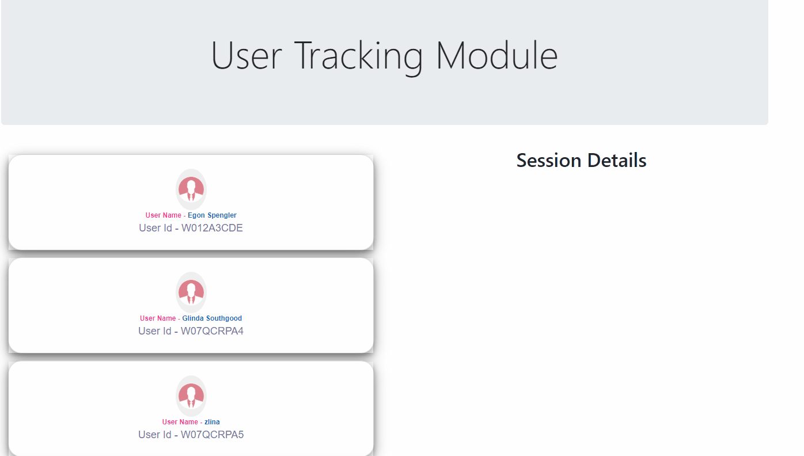

# User's Session Tracker React Application
----
***User's Session Tracker*** is a Web application developed using React JS, Html, CSS and Node. In real world, tracking User's activities has become a challenging problem. This problem has been solved by developing a Session tracker for User's activities using advanced tools and techonlogies like React and Node. This Tracker can be leveraged by companies to track their employees various activities in their application usage. This tracker has many practical realtime usage.

This application mainly provide User Interface to track the User's activities within selected period over month or year and within a particular day as well. It mainly allows user to view a list of hardcoded users from a Mock API (A JSON file has been used in which a list of mock users & their corresponding periods of activity across multiple months are described.) server which can be replaced in future by actual API. On Selecting any user from the list of Users, a modal opens which displays all the time ranges during which the particular user was active on that day. 
The application also provide a calendar option for user to select a particular day to track individual's activity within the day.

### Steps to be followed to Run the User's Session Tracker
----
This Project code is available in the root folder of the project repository as User_session_Tracker-master. 
##### Pre-requisites: 
- Install Node version v10.14.1
- Insatll React version 16.13.1 
- Install dependencies like ***connect-api-mocker, express, axios, cors, date-fns and react dependencies***
##### Program Execution Locally: 
- Go main folder User_session_Tracker-master and execute below command in your terminal to install the node modules.
    ```
    npm install
    ```
- Run below command to execute the tracker on the server in http://localhost:3000 port.
    ```
    npm run dev
    ```
    
### User's Session Tracker: 
----
<p align="center">
  
</p>

##### How to Track User's activities:
- Select any user from the list of Users from main page to check the session details for the selected day.
- Once the session details are visible, User can choose the particular date from the  calendar to view activities for that selected date. (The show calendar has been designed to highlight with the days of which the user was active.)
- On selection of highlighted days, the session details of that day will be displayed.

### Contributions
----
- The main contributor for this project is **Yashas B.**

### License
----
Contributions are welcomed.
